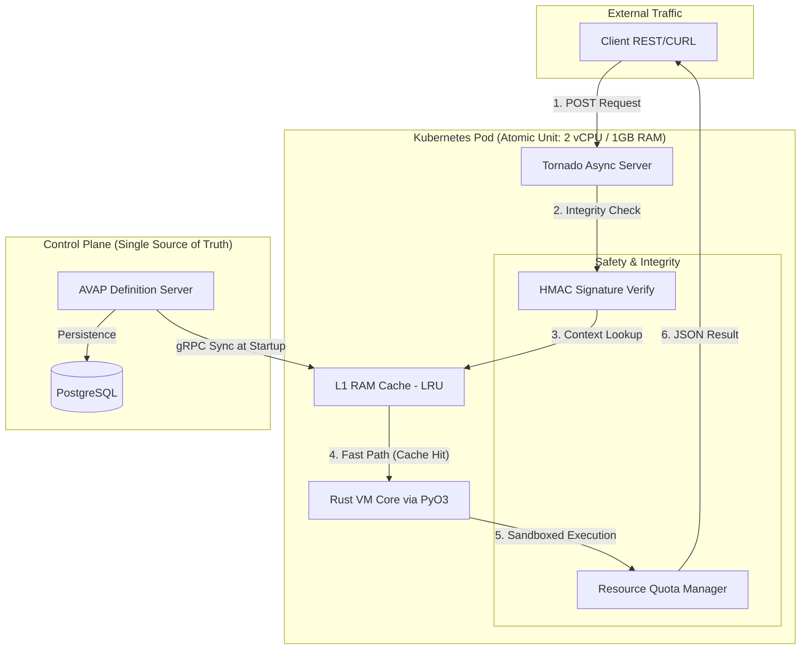

# AVAP Language Server Lite Architecture

This document outlines the internal mechanics and high-performance pipeline of the AVAP execution engine, specifically focusing on its **Subordinated Worker** design for Tier 1 environments.

---

## 1. High-Level Architecture
The system follows a **Stateless Worker Pattern**. It offloads the "Brain" (Command Definitions & Persistence) to a centralized server, allowing the Language Server to focus exclusively on **cryptographic verification and high-speed execution**.

### System Schema (Data Flow)

---

## 2. Execution Pipeline

1.  **Request Layer (Python/Tornado)**: Acts as a non-blocking I/O orchestrator. It manages thousands of concurrent TCP connections using an asynchronous event loop, ensuring minimal overhead per request.
2.  **Integrity Layer (HMAC-SHA256)**: Every incoming bytecode package or script execution request is verified against a shared secret. This ensures that only pre-approved, signed logic is executed by the VM.
3.  **L1 Cache (Zero-Latency Retrieval)**: The worker maintains an in-memory LRU (Least Recently Used) cache of the command catalog. This eliminates database round-trips during the critical path, enabling sub-15ms baseline latencies.
4.  **Execution Layer (Rust VM via PyO3)**: Validated Intermediate Representation (IR) is passed to the Rust Virtual Machine. By using **PyO3**, the engine bypasses the Python Global Interpreter Lock (GIL) for the execution phase, leveraging true hardware concurrency.
5.  **Sandboxing & Scopes**: The VM enforces strict memory isolation. It manages three distinct variable pools (**Global, Local, and Function-scoped**) to ensure that concurrent executions do not leak state or data.

---

## 3. Key Technologies

* **Tornado (Python)**: High-concurrency web server chosen for its proven stability in long-lived connection management.
* **Rust VM**: The core engine, providing C-level performance with modern memory safety guarantees to prevent buffer overflows or segmentation faults.
* **PyO3**: A high-performance bridge for seamless data transfer between the Python orchestrator and the Rust execution core.
* **gRPC**: Used for the "Subordinated Sync" protocol, allowing the worker to receive real-time updates from the Definition Server with minimal network overhead.

---

## 4. Scalability & Resilience

### Horizontal Scaling
The worker is entirely **Stateless**. Scaling the cluster's total capacity is a linear process: adding a new 2-vCPU node adds exactly ~5,000 RPS to the total throughput capacity.

### Fault Isolation (Bulkheading)
As documented in our [Performance Audit](./PERFORMANCE.md), the system utilizes a "Fail-Fast" approach. If a script exceeds resource quotas or fails signature verification, it is discarded in **<40ms**, ensuring that faulty or malicious requests cannot starve the CPU resources required by healthy users.

---

## 5. Technical Specifications
* **Concurrency Model**: Asynchronous I/O + Multithreaded Rust VM.
* **Communication**: gRPC (Internal Sync) / REST (External API).
* **Security**: HMAC-SHA256 Bytecode Signing.
* **Memory Management**: 512MB Reserved for Burst Garbage Collection.