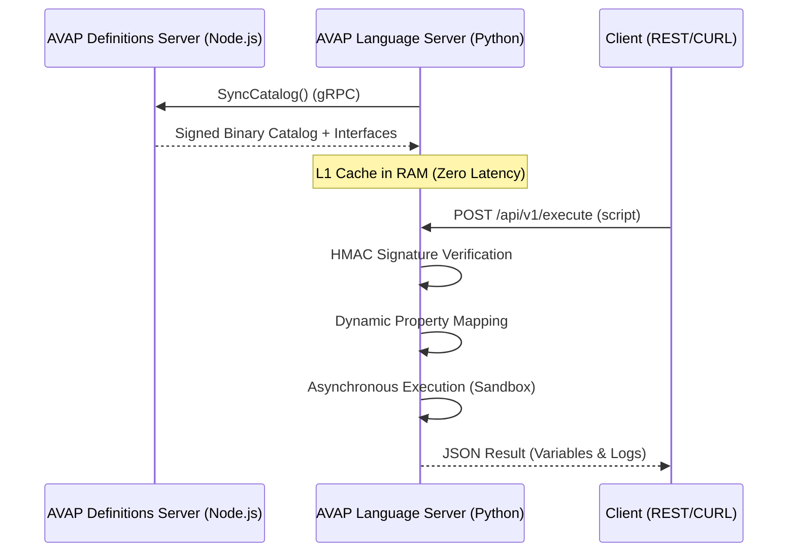

# AVAP Language Server Lite (OSS)

**AVAP Language Server Lite** is a high-performance asynchronous execution engine designed to process AVAP scripts in distributed environments. This version implements the **Subordinated Architecture**, where the language server acts as a stateless execution node powered by a centralized definition server.

> [!IMPORTANT]
> **Core Philosophy:** This project is moving toward a **Contract-Based Execution Model**. Before diving into the technical details, please read our [**Architecture Intent & Logic Flow (INTENT.md)**](./INTENT.md) to understand the vision of subordinated logic, cryptographic safety, and the evolution of the ecosystem.

---

## 1. Distributed Architecture (Phase IV)

This branch represents the transition from a foundational MVP to a global enterprise-scale architecture.

### Architecture at a Glance
* **Core:** Python (Tornado) for high-concurrency async I/O.
* **Execution:** Pre-compiled signed bytecode distribution.
* **Security:** HMAC-SHA256 integrity verification.
* **Ops:** Kubernetes-native, designed for stateless horizontal scaling.

### The "AVAP Definition Server & Worker" Ecosystem
* **AVAP Definition Server (Node.js/gRPC):** Acts as the *Single Source of Truth* and *Build Server*. It handles persistence, interface management, and cryptographic bytecode packaging.
* **AVAP Language Server Lite (Python/Tornado):** A pure execution node. It synchronizes the command catalog via gRPC at startup and executes them in an asynchronous sandbox with real-time integrity validation.

---

## 2. Security & Integrity Verification

Trust between the Brain and the LSP is guaranteed through a cryptographic signature:

1.  **HMAC-SHA256 Signing:** The Brain signs every binary package using a shared secret key.
2.  **Binary Header:** Packages use a proprietary format with the Magic Number `AVAP` (`41 56 41 50`).
3.  **Integrity Check:** Before every execution, the LSP verifies that the signature matches. If the bytecode has been tampered with or the signature is invalid, execution is aborted for safety.

---

## 3. Distributed Execution Flow

---

## 4. Environment Configuration

| Variable | Description | Default Value |
| :--- | :--- | :--- |
| `BRAIN_HOST` | gRPC Definition Engine Host | `avap-definition-engine` |
| `BRAIN_PORT` | gRPC Service Port | `50051` |
| `API_KEY` | gRPC Authentication Token (Metadata) | `avap_secret_key_2026` |
| `AVAP_INTERNAL_KEY` | Secret Key for HMAC Signatures | `avap_secure_signature_key_2026` |

---

## 5. Performance & Reliability

This engine is engineered for mission-critical workloads. Every release is audited against a strict **Tier 1 Service Level Objective (SLO)**.

* **High Throughput:** Certified to handle **>5,000 RPS** per 2-vCPU node.
* **Predictable Latency:** p95 stability at **210ms** even under 90% CPU saturation.
* **Resilience:** Built-in **Fail-Fast** mechanisms and cryptographic integrity checks that isolate faulty traffic from healthy users.

> [!IMPORTANT]
> **Detailed Benchmarks:** For a deep dive into our concurrency limits, M2 baseline efficiency, and chaos testing results, read the [Full Performance Audit (PERFORMANCE.md)](./PERFORMANCE.md).

---

## 6. Current Status & Path to v1.0

We are currently executing the middle phases of our strategic plan:

1.  **Foundational (Phases I-III):** Established the Tornado async bridge and secure sandboxing.
2.  **Production Ready (Phases IV-VI):** **(Current)** Implementing gRPC subordinated sync, signed bytecode distribution, and layered caching.
3.  **Enterprise Scale (Phases VII-XI):** Hardening, Rust VM integration via PyO3 for memory safety, and multi-region deployment.

> [!TIP]
> **For the full technical specification, including detailed components, performance targets, and risk mitigation, please see our [Detailed Strategic Roadmap (ROADMAP.md)](./ROADMAP.md).**

---
© 2026 AVAP Sphere.